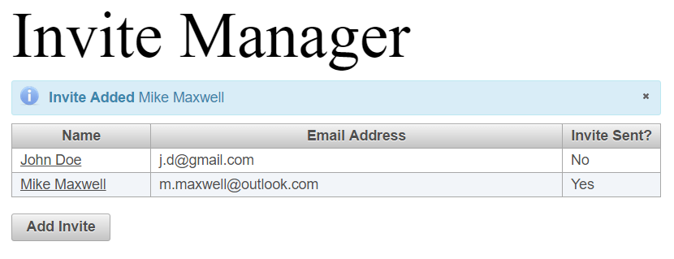

# Pattern: Managing a List of Items via a Dialog
... Using a Java EE container with JSF and Primefaces

This is a small demo application prepared in support of a blog post.

The blog post is on [Wordpress](https://philthedeveloper.wordpress.com/2016/10/17/pattern-managing-a-list-of-items-via-a-dialog/).
A video of the application in use is also available on [YouTube](https://www.youtube.com/watch?v=oDeSL3EFP5U).

